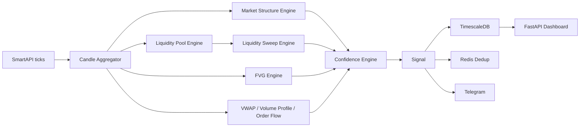

# Market Matrix

Market Matrix is a Python trading signal detection platform for Indian equities. It is designed as a production-grade notification system, not a retail chart indicator. The platform ingests SmartAPI market data, builds multi-timeframe Smart Money Concepts context, scores institutional-style setups, persists signal context, and sends explainable Telegram notifications.

The current implementation focuses on reducing false positives in market structure, BOS, CHoCH, liquidity sweeps, and Fair Value Gaps.

## Architecture

```text
trading_system/
|-- config/             Settings and environment variables
|-- core/               Pydantic schemas, SQLAlchemy models, migrations, cache
|-- data/               SmartAPI client, symbol manager, candle aggregation
|-- engines/            Detection and scoring engines
|   |-- market_structure.py             Internal/external structure, BOS, CHoCH, MSS
|   |-- liquidity_sweep.py              Liquidity pools and validated sweeps
|   |-- fair_value_gap.py               FVG detection, lifecycle, quality scoring
|   |-- multi_timeframe_confluence.py   15m/5m/1m structure confluence
|   |-- anchored_vwap.py                Anchored VWAP signals
|   |-- volume_profile.py               POC, VAH, VAL, HVN, LVN
|   |-- order_flow.py                   Delta, RVOL, large trade proxy
|   |-- signal_aggregator.py            Confidence engine and signal construction
|-- notifications/      Telegram alerts
|-- api/                FastAPI monitoring dashboard
|-- backtesting/        Historical replay and setup analytics
|-- utils/              Helpers
```



## Reference Implementation Notes

Market Matrix incorporates ideas from `joshyattridge/smart-money-concepts` without copying its code.

Useful ideas adopted:

- Symmetric swing high/low detection using candles before and after the candidate pivot.
- Cleanup of consecutive same-side swing pivots before BOS/CHoCH logic.
- BOS/CHoCH should be tied to a broken level and a broken candle index.
- Liquidity should be modeled as clustered highs/lows, not only as wick rejections.
- FVGs should track mitigation/fill state after formation.

Production changes added in Market Matrix:

- Stateful internal and external structure.
- Protected highs and protected lows.
- Displacement validation for BOS, CHoCH, MSS, sweeps, and FVGs.
- Liquidity pool age, strength, type, bounds, and provenance.
- Explainable 0-100 scoring.
- Database fields for lifecycle tracking and backtest analytics.

## Engine Implementation

### 1. Market Structure Engine

File: `trading_system/engines/market_structure.py`

The redesigned engine uses a stateful swing stream instead of analyzing highs and lows independently.

Implemented concepts:

- External structure: major swing highs/lows.
- Internal structure: minor swing highs/lows.
- Swing labels: HH, HL, LH, LL.
- Protected highs and protected lows.
- Bullish BOS and bearish BOS.
- Bullish CHoCH and bearish CHoCH.
- Market Structure Shift (MSS).
- Displacement scoring.
- Close-break validation by default.

State machine:

```text
RANGING
  -> BULLISH when price breaks a high with displacement
  -> BEARISH when price breaks a low with displacement

BULLISH
  -> BULLISH BOS when price breaks a structural high
  -> BEARISH CHOCH when price breaks the protected low
  -> BEARISH MSS when CHOCH is confirmed with strong displacement

BEARISH
  -> BEARISH BOS when price breaks a structural low
  -> BULLISH CHOCH when price breaks the protected high
  -> BULLISH MSS when CHOCH is confirmed with strong displacement
```

False-positive controls:

- Pivots must be confirmed by left/right lookback.
- Same-side pivots are cleaned into an alternating stream.
- BOS/CHoCH require a real break of a protected or structural level.
- Weak breaks without displacement are rejected.

### 2. Liquidity Pool and Sweep Engines

File: `trading_system/engines/liquidity_sweep.py`

Liquidity is now modeled in two stages.

`LiquidityPoolEngine` detects:

- Equal highs.
- Equal lows.
- Triple tops.
- Triple bottoms.
- Session highs.
- Session lows.
- Previous day high.
- Previous day low.
- Weekly high.
- Weekly low.

Each pool stores:

- Pool ID.
- Liquidity type.
- Buy-side or sell-side.
- Price level.
- Upper and lower bounds.
- Touch count.
- Age in candles.
- Strength score.
- Source indices.

`LiquiditySweepEngine` validates a sweep only when:

1. The liquidity pool existed before the sweep candle.
2. Price breached the pool boundary.
3. Price rejected and closed back through the pool.
4. Reversal displacement was present.

Sweep score inputs:

- Pool strength.
- Wick/rejection quality.
- Breach depth.
- Displacement score.
- Relative volume score.

### 3. Fair Value Gap Engine

File: `trading_system/engines/fair_value_gap.py`

The FVG engine detects directional three-candle imbalances and tracks lifecycle state.

Implemented FVG types:

- Bullish FVG: candle 3 low is above candle 1 high, with bullish impulse candle.
- Bearish FVG: candle 3 high is below candle 1 low, with bearish impulse candle.

Lifecycle states:

- `OPEN`
- `PARTIALLY_FILLED`
- `FULLY_FILLED`

Tracked fields:

- Gap high and gap low.
- Formation time.
- First retest time.
- Fill percent.
- Filled time.
- Volume at formation.
- Quality score.
- Score breakdown.

FVG quality score:

| Factor | Purpose |
|--------|---------|
| Gap size | Filters tiny inefficiencies |
| Displacement | Confirms institutional impulse |
| Volume | Confirms participation |
| Trend alignment | Favors directionally aligned gaps |
| Liquidity context | Rewards FVGs after sweeps |
| Structure context | Rewards FVGs after BOS/CHoCH/MSS |

### 4. Multi-Timeframe Confluence

File: `trading_system/engines/multi_timeframe_confluence.py`

Canonical model:

```text
15m external structure = directional bias
5m internal structure  = pullback or continuation context
1m execution structure = entry confirmation
```

Example long model:

```text
15m bullish external structure
5m pullback into discount / liquidity area
1m bullish CHoCH or MSS
Bullish FVG after sell-side sweep
```

### 5. Confidence Engine

File: `trading_system/engines/signal_aggregator.py`

The old scoring model has been replaced.

| Component | Weight |
|-----------|--------|
| Market Structure | 25% |
| Liquidity Sweep | 30% |
| Fair Value Gap | 20% |
| Anchored VWAP | 10% |
| Volume Profile | 10% |
| Volume Confirmation | 5% |

Signals return:

- 0-100 confidence score.
- Component scores.
- Weighted contribution.
- Human-readable reasons.
- JSON explainability payload.

Example reasoning:

```text
Weekly High sweep (91) | Bearish CHOCH | Bearish FVG | VWAP alignment | Negative volume confirmation
```

## Database Changes

Files:

- `trading_system/core/models.py`
- `trading_system/core/migrations.py`

New and enriched fields include:

- Market structure: scope, direction, protected high/low, broken level, displacement score, strength score, source index, broken index, metadata.
- Liquidity zones: pool ID, liquidity type, bounds, age, strength score, source indices, metadata.
- FVGs: first retest time, fill percent, displacement score, trend score, liquidity score, structure score, score breakdown.
- Signals: market structure score, volume confirmation score, explainability JSON, planned RR, MFE, MAE.

Run migrations after pulling these changes:

```bash
python -c "
import asyncio
from trading_system.core.database import async_engine, init_db
from trading_system.core.migrations import run_migration

async def setup():
    await init_db()
    await run_migration(async_engine)

asyncio.run(setup())
"
```

## Backtesting

File: `trading_system/backtesting/engine.py`

The backtester now stores and reports:

- Entry.
- Stop loss.
- Target 1 and target 2.
- Planned RR.
- Outcome.
- Achieved RR.
- MFE: maximum favorable excursion in R.
- MAE: maximum adverse excursion in R.
- Win rate.
- Profit factor.
- Expectancy.
- Setup performance.

Example:

```python
from trading_system.backtesting.engine import BacktestEngine
from trading_system.data.smartapi_client import AngelOneClient

client = AngelOneClient()
await client.authenticate()

candles = await client.backfill_symbol(
    symbol="RELIANCE-EQ",
    token="2885",
    exchange="NSE",
    timeframe="15m",
    days=90,
)

engine = BacktestEngine()
result = engine.run_backtest("RELIANCE-EQ", candles, "15m")

print(result.summary())
```

## Quick Start

### Prerequisites

- Python 3.11+
- PostgreSQL 16 with TimescaleDB extension
- Redis 7+
- Angel One SmartAPI account
- Telegram bot for notifications

### Setup

```bash
cd Gameplan
python -m venv venv
venv\Scripts\activate
pip install -r trading_system/requirements.txt
copy .env.example .env
```

Edit `.env` with your credentials.

### Run

```bash
python -m trading_system.main
```

Start the dashboard API in another terminal:

```bash
uvicorn trading_system.api.app:app --host 0.0.0.0 --port 8000 --reload
```

Docker:

```bash
docker-compose up -d
```

## Configuration

Main settings are controlled by environment variables. See `.env.example`.

| Variable | Description | Default |
|----------|-------------|---------|
| `ANGEL_API_KEY` | Angel One API key | - |
| `ANGEL_CLIENT_CODE` | Trading account code | - |
| `ANGEL_PASSWORD` | Account password | - |
| `ANGEL_TOTP_SECRET` | TOTP secret for 2FA | - |
| `DB_HOST` | PostgreSQL host | localhost |
| `REDIS_HOST` | Redis host | localhost |
| `TELEGRAM_BOT_TOKEN` | Telegram bot token | - |
| `TELEGRAM_CHAT_ID` | Telegram chat/group ID | - |
| `SIGNAL_MIN_CONFIDENCE_SCORE` | Minimum score for notification | 80.0 |
| `SIGNAL_EQUAL_LEVEL_TOLERANCE` | Equal high/low tolerance | 0.001 |
| `SIGNAL_FVG_MIN_GAP_PERCENT` | Minimum FVG size | 0.1 |
| `SIGNAL_SWEEP_MIN_WICK_RATIO` | Minimum rejection wick ratio | 0.6 |
| `SIGNAL_VOLUME_SPIKE_THRESHOLD` | Volume expansion threshold | 2.0 |

## Signal Logic

High-confidence long setup:

1. 15m structure is bullish or has bullish MSS.
2. Sell-side liquidity pool is swept.
3. Sweep rejects and produces displacement.
4. Bullish FVG forms or remains nearby.
5. Price is above or reclaiming anchored VWAP.
6. Volume profile supports the entry area.
7. Volume delta and RVOL confirm buying pressure.

High-confidence short setup:

1. 15m structure is bearish or has bearish MSS.
2. Buy-side liquidity pool is swept.
3. Sweep rejects and produces displacement.
4. Bearish FVG forms or remains nearby.
5. Price is below or rejecting anchored VWAP.
6. Volume profile resists the entry area.
7. Volume delta and RVOL confirm selling pressure.

## False-Positive Filters

Market Matrix avoids:

- Fake CHoCH: requires protected level break plus displacement.
- Weak BOS: rejects low-range, low-body, wick-only breaks.
- Random equal highs/lows: uses pivot clustering, tolerance bands, touch count, and pool age.
- Tiny FVGs: applies minimum gap percent and quality scoring.
- Low-volume sweeps: volume score contributes to sweep strength and final confidence.
- Single-factor alerts: no signal is sent unless weighted confluence reaches the configured threshold.

## API Endpoints

| Endpoint | Description |
|----------|-------------|
| `GET /health` | Health check |
| `GET /api/signals` | Recent signals |
| `GET /api/signals/active` | Active signals |
| `GET /api/fvgs` | Fair Value Gaps |
| `GET /api/liquidity-zones` | Liquidity zones |
| `GET /api/vwaps` | Anchored VWAP levels |
| `GET /api/dashboard` | Dashboard summary |
| `GET /api/stats` | Win rate and RR stats |

## Testing

```bash
pytest -q -p no:cacheprovider
python -m compileall -q trading_system
git diff --check
```

Current verification after the SMC redesign:

```text
21 tests passed
compileall passed
diff check passed
```

## Production Notes

- The system generates notifications only. It does not place orders.
- SmartAPI order flow is a proxy, not true exchange-level order book flow.
- Redis is used for signal deduplication.
- TimescaleDB is used for time-series candle and event storage.
- Telegram notifications should include the explainability reasons, not only the score.
- Backtests should be evaluated by setup type and regime, not just aggregate win rate.

## Prioritized Roadmap

1. Wire the multi-timeframe confluence engine into the live orchestrator for simultaneous 15m, 5m, and 1m context.
2. Persist every market structure, liquidity pool, sweep, and FVG event for post-trade research.
3. Add scenario tests for fake CHoCH, weak BOS, low-volume sweeps, random equal highs, and tiny FVGs.
4. Calibrate scoring thresholds per symbol class and volatility regime.
5. Add dashboard views for pool type, FVG quality bucket, MFE/MAE, expectancy, and setup performance.
6. Add walk-forward backtesting and out-of-sample validation.

## Disclaimer

Market Matrix is for research, education, and notification workflows. It is not financial advice and does not guarantee trading performance. Always apply independent analysis and risk controls.
